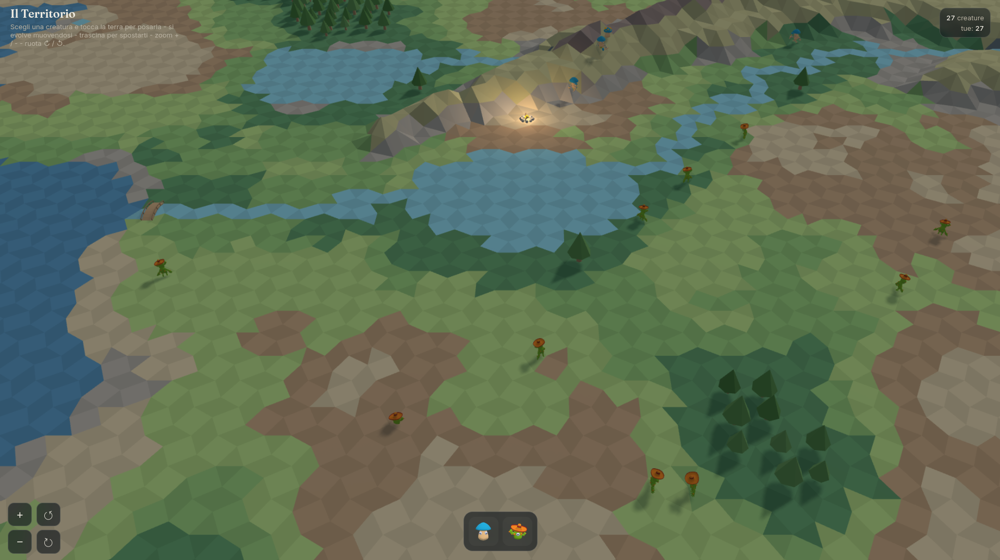
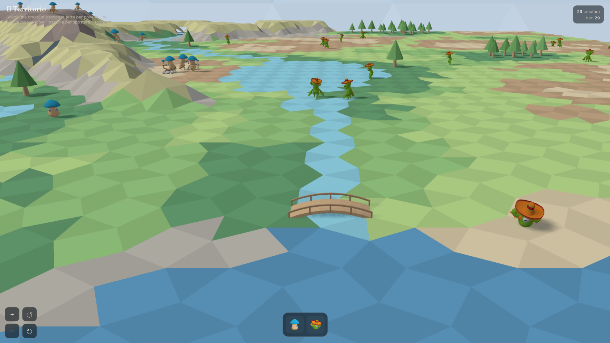

# Meadow

A living, low-poly creature simulation you can watch, tend, and shape.

 

Place little mushroom and cactus creatures on a tessellated world, and watch them
roam, meet, bond, and evolve. It runs entirely in the browser — a single
self‑contained page, no install, no build step.

**Live:** served [here](https://buggcatcher.github.io/Meadow/).

---

## How the creatures make decisions

Meadow's creatures are **not** driven by needs bars or utility‑maximization. Their
behavior **emerges from relationships** — with each other, with the land, and with
you. When a creature is idle, it periodically decides what to do, and that choice is
shaped by what it perceives and who it knows:

- **Perception & relationships.** A creature notices the others nearby and the bonds
  it already has. It is more likely to approach and interact with creatures it has
  met before — friendships bias future choices, so little social patterns build up
  over time.
- **A vocabulary of actions**, split into two kinds:
  - *Moves (on itself):* idle emotes like **dance, jump, nod, duck**, plus two ways of
    wandering — **Gironzola** (strolls in a small area around where it started) and
    **Vagabonda** (roams freely across the map).
  - *Interactions (toward another):* **greet**, **dance together**, **attack** (the
    target turns to face the attacker and plays its "hit" reaction), **follow**, and
    **orbit**.
- **Bonds grow from contact.** Greeting, dancing, and meeting strengthen the link
  between two creatures, which in turn makes future encounters more likely — a small
  feedback loop that produces emergent, lifelike social behavior.
- **Evolution through movement.** The more a creature moves and lives, the closer it
  gets to its next form. Mushrooms evolve twice (Mushnub → Mushnub Evolved → Mushroom
  King); cacti once (Cactoro → Cactoron). Position, facing and bonds carry over.
- **The world is authoritative.** The simulation always has the final say: water and
  dense forest are impassable, creatures stay on the terrain surface, and every action
  is validated against the world's rules. The idea is simple:

  > **Perception suggests · the code decides · the world executes.**

You are part of the loop too: placing, petting, and moving creatures nudges the little
community along. The design goal is a world where *life emerges from interaction* —
between creatures, with the terrain, and with you — rather than from stats.

---

## Multiplayer — coming soon

Meadow is built on a **shared, persistent world**. The next step is **multiplayer**:
creatures placed by different people will inhabit the **same meadow**, meet one
another, and leave a mark that everyone can see.

Planned alongside it:

- a shared **hearth** to gather around in the evening — for warmth, cooking, and
  forming bonds,
- trails and history that the land itself remembers.

*(These are on the roadmap — the current build is the single‑player sandbox.)*

---

## Controls

- **Tap/click the ground** to place the selected creature (pick a species from the bar
  at the bottom first).
- **Pick up and drag a creature** to place it; **drag the ground** to pan the camera.
- **Scroll / pinch** to zoom (the camera tilts toward the horizon as you zoom in).
- **Rotate** the view with the on‑screen buttons.
- **Right‑click / long‑press** a creature for its menu (moves & interactions).

---

`built with claude pro in 3 sessions`
